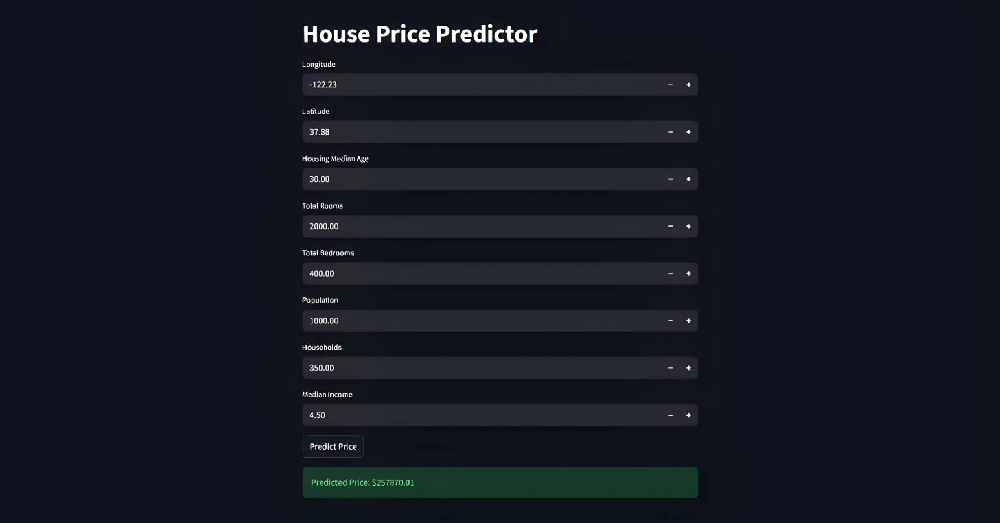
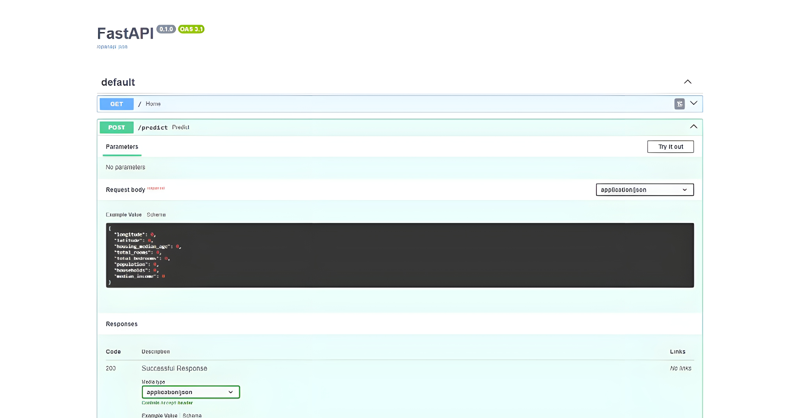

# House Price Prediction System (End-to-End ML App)

Developed and deployed an end-to-end machine learning application that predicts house prices using regression models with real-time API integration.

---

## 📸 Demo




---

## 🧠 What it does

Users input house-related features and the system predicts the estimated price using a trained regression model served through an API and Streamlit interface.

---

## ⚙️ Key Features

• Cleaned and processed housing datasets by handling missing values, outliers, and inconsistent features  
• Performed feature engineering and data transformation for model readiness  
• Trained and compared multiple regression models using Scikit-learn  
• Selected the best-performing model based on evaluation metrics  
• Built a FastAPI backend for real-time prediction serving  
• Developed a Streamlit frontend for interactive user input and predictions  

---

## 🧪 Model Workflow


Input Features → Data Preprocessing → Feature Engineering → Regression Model → Price Prediction

---

## 🛠️ Tech Stack

Python · Pandas · NumPy · Scikit-learn · FastAPI · Streamlit

---

## 🧩 Skills

Machine Learning · Regression Analysis · Feature Engineering · API Development · Model Deployment · Data Preprocessing

---

## 📁 Project Structure


House-Price-Prediction/
│
├── app.py # Streamlit frontend
├── main.py # FastAPI backend
├── model.pkl # Trained regression model
├── scaler.pkl # Feature scaler
├── assets/
│ ├── demo.png
│ ├── ui.png
│ └── prediction.png
├── notebooks/
└── requirements.txt


---

## ▶️ Run Locally

```bash
pip install -r requirements.txt
uvicorn main:app --reload
streamlit run app.py
